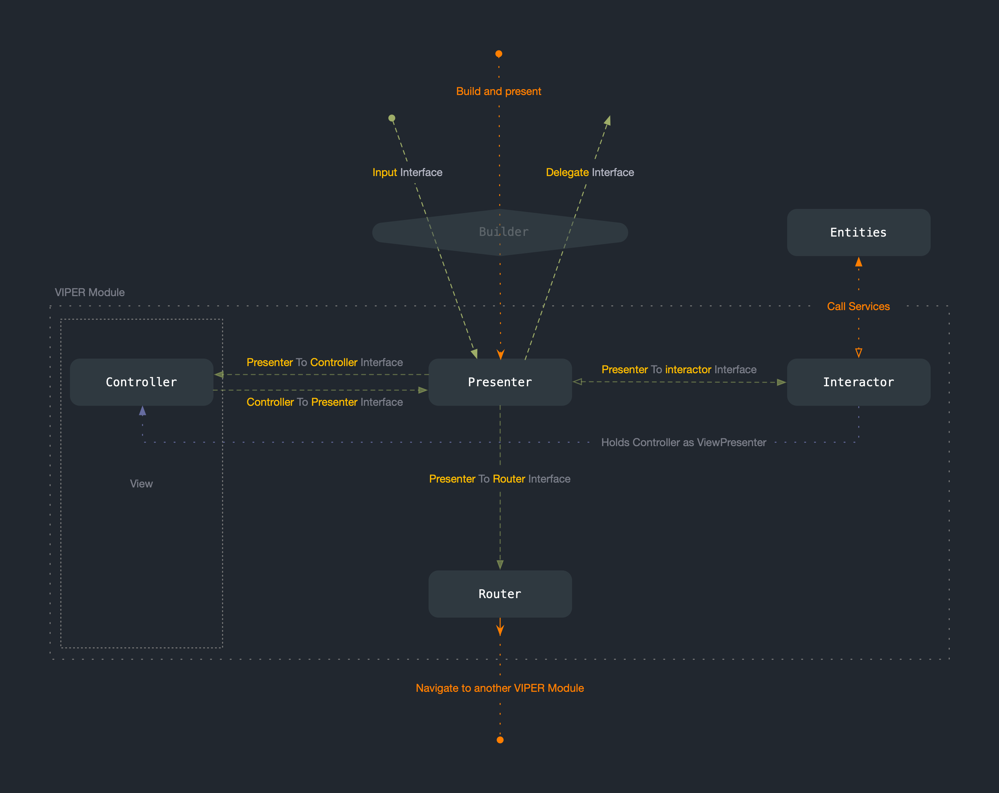

# VIPERLib

<p align="center">

</p>

<p align="center">

<br>


</p>

## Description

Library that helps you implementing the [VIPER](https://www.objc.io/issues/13-architecture/viper/) architecture with UIKit.

## Installation

Use `Swift Package Manager` to install.

## Concept

<p align="center">

</p>

## Module Generation

Use [Generamba](https://github.com/strongself/Generamba) code generator to instantly generate VIPER module groups and classes inside Xcode and your project directory.

1. Run `gem install generamba` inside terminal if Generamba is not installed already.
2. Run [`generamba setup`](https://github.com/rambler-digital-solutions/Generamba/wiki/Available-Commands#basic-generamba-configuration) in the project root folder. This command helps to create [Rambafile](https://github.com/rambler-digital-solutions/Generamba/wiki/Rambafile-Structure) that define all configuration needed to generate code. You can modify this file directly in future.
3. Add VIPER module templates planned to use in the project to the generated Rambafile:

```yaml
### Catalogs
catalogs:
- 'https://github.com/littleigloo/Generamba-Template-Catalog.git'

### Templates
templates:
- {name: viper_module}
```

4. Run `generamba template install`. All the templates will be placed in the `Templates` folder of your current project.

5. To generate a new module with a specific name run the following command in the project root folder:
```bash
generamba gen [Module Name] viper_module'
```

## Example

Check the example project included in the repo for experimenting and better undestanding of VIPER concept. The detailed information about the `Generamba` tool is available in [Generamba Wiki](https://github.com/rambler-digital-solutions/Generamba/wiki/Template-Structure).

## Credits

Created and maintained by [epitonium](https://github.com/epitonium).

## License

`VIPERLib` is distributed under the terms and conditions of the [LICENSE](https://github.com/littleigloo/VIPERLib/blob/master/LICENSE.md).
